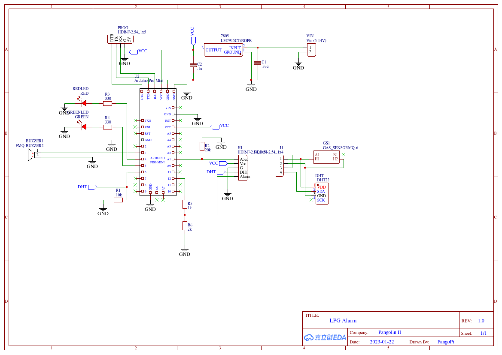

# lpg_sensor
LPG alarm using MQ-6 sensor and Arduino.

# Brief
This is an LPG detection and alarm system based off a MQ-6 sensor that runs on an Arduino Pro Mini (ATMEGA328P). Uses a temperature and humidity sensor to normalise the measurements according to the datasheet for the MQ-6 sensor. The arduino employs a watchdog to make sure the software keeps running even when errors are encountered. The software also checks if the gas sensor is still connected and sounds an alarm if it can't find the sensor. When the DHT temp/hum sensor is not found or in another way faulty a gas calculation is still performed but can't be normalised. A error code is indicated on the device to show this error.

## Features:
- Measures the presence of LPG in ppm
- Sound alarm when ppm threshold reached
- Outputs a TTL (3.3V) HIGH signal when gas threshold value is reached to communicate with other devices. This output goes low again when the user has reset the alarm
- Green LED to indicate sensor is working and taking samples
- Red LED steady to indicate gas detected
- Red light blinking to indicate errors
- When an error occurs that prevents LPG measurements, the green LED will be switched off, otherwise the green light will stay lit indicating valid samples are still being taken.
- Watchdog timer (500ms)
- Chirp alarm and/or blink error LED on following errors:
    - Gas sensor not found
    - DHT temp/hum sensor not found

## Operation status indicators:
Green | Red | Alarm | State
--- | --- | --- | ---
On |   Off  | None  | Normal operation and taking and analysing samples
Slow | Off  | None  | Startup: Performing warmup and calibration
On   | Off  | Tone  | Startup: Calibration finished
Slow | Off  | None  | Recalibating sensor
On   | On   | Fast  | Gas detected over threshold
On   | On   | Beep every 90s  | Gas detected over threshold, alarm silenced
On   | Fast | Chirp | Gas detected but under threshold
On   | Fast | Chirp every 90s | Gas detected under threshold, alarm silenced
Off  | On   | Chirp | Gas sensor not detected or faulty (cannot be silenced)
On   | Slow | None  | Temp/Hum sensor faulty (not critical)

## Planned features
Maybe one day I will add a few features, such as:
- Store calibration data in EEPROM
- Verify sensor readings
- Verify calibration result (maybe check EEPROM to make sure values aren't too far off from expected)

# Quick schematic of the connections
Very quickly made schematic of the sensor. It's powered by a 7805 voltage regulator and the whole circuit draws about 180mA. A heatsink is recommended when powering off 12V.

# LED fault detections
There is also a possibility to check if the LED's are disconnected or otherwise faulty. The code works but is currently not used since it's not very useful to know if a LED has failed in some way. The LED's light up at startup and a brief beep is played on the buzzer to show they are working anyway.

# Note
The strategies for normalisation of the gas sensor readings are taken from code found [here](https://www.savvysolutions.info/savvymicrocontrollersolutions/arduino.php?topic=arduino-mq6-lpg-gas-sensor). More info on the formulas used can be found [here](https://www.savvysolutions.info/savvymicrocontrollersolutions/index.php?sensor=mq-6-gas-sensors).